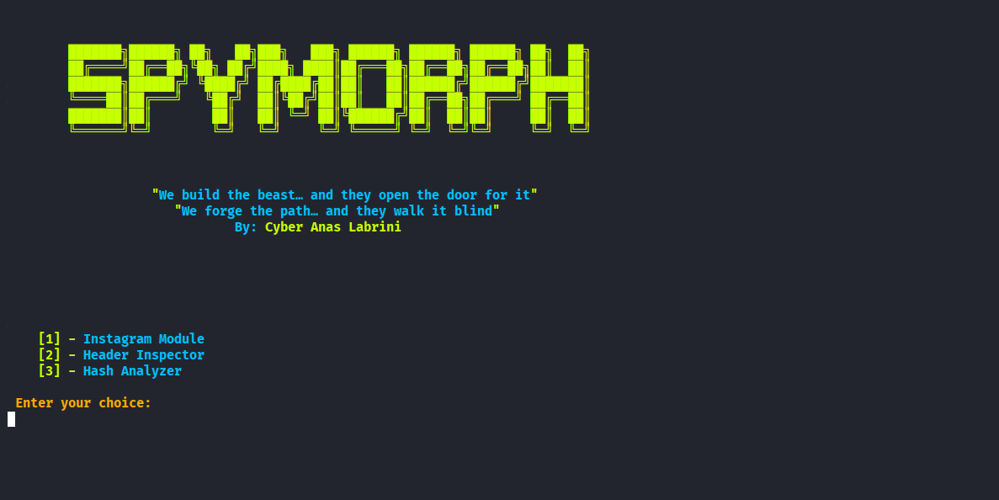

# SpyMorph — Multi-Layered Offensive Security Framework

> **Category:** Offensive Security / Red Team Research  
> **Platform:** Linux (Root-level execution)  
> **Status:** Educational & Research-Oriented (High-Risk)

---

## ⚪️ Overview


**SpyMorph** is a multi-stage, multi-layered offensive security framework designed to demonstrate **advanced Red Team techniques** related to execution flow control, payload concealment, staged decryption, stealth execution, and long-term persistence on Linux systems.

The project illustrates how **real-world attack chains** are structured, emphasizing **modularity**, **anti-forensics**, **in-memory execution**, and **systemd-based persistence**.

> ⚠️ This project is intended **strictly for educational purposes, defensive research, and authorized penetration testing environments**.

---

## ⚪️ High-Level Execution Flow

SpyMorph follows a **layered execution model**, where each stage unlocks and triggers the next:

1. **SM.py** → Entry point & dispatcher  
2. **deco.py** → Decryption loader  
3. **ed.py** → Encrypted data container  
4. **shadow_enc.py** → Stealth execution & cleanup  
5. **Remote Encrypted Payload (GitHub)** → Persistence logic  

Each stage is minimal, isolated, and designed to **terminate silently** upon failure, leaving **no recoverable artifacts**.

---

## ⚪️ File Responsibilities (Detailed)

### 🔹 SM.py — Main Controller & Dispatcher

- Verifies execution with **root privileges**
- Terminates if privileges are insufficient
- Executes `deco.py`
- Displays a menu with three modules:
  1. Instagram-related operations
  2. HTTP Header inspection
  3. Hash analysis utilities
- Validates user selection and dispatches execution
- Rejects invalid selections gracefully

---

### 🔹 deco.py — Decryption Loader Stage

- Imports `ed.py` as encrypted data source
- Terminates silently if missing
- Extracts encrypted data block
- Decrypts a hard-coded encrypted URL
- Retrieves a hidden password from remote HTML
- Decrypts the main payload
- Writes decrypted output to `shadow_enc.py`
- Executes `shadow_enc.py` automatically
- Any failure results in silent termination

---

### 🔹 ed.py — Encrypted Data Repository

- Contains unused variables: `config_password`, `maybe_hint`
- Stores main encrypted payload in `encrypted_blob`
- Does not execute code
- Acts purely as encrypted storage

---

### 🔹 shadow_enc.py — Stealth Execution & Anti-Forensics Stage

1. Extracts hidden password from `asc.jpg`
2. Downloads encrypted payload from GitHub
3. Decrypts payload using extracted password
4. Executes decrypted code in-memory via `exec()`
5. Overwrites critical files with random data
6. Permanently deletes overwritten files
7. Sanitizes memory
8. Self-deletes safely
9. Terminates execution

---

## 🔴 Remote Encrypted Payload (GitHub)

- Verifies existence of `payload.elf`
- Terminates silently if missing
- Copies payload to hidden `/root` directories
- Sets executable permissions
- Validates root privileges
- Copies systemd service files
- Reloads daemon configuration
- Enables & starts services via `systemctl`
- Restarts payload every 20 seconds if stopped
- Runs silently with near-zero CPU/RAM usage
- Terminates if no service files are found

---

## ⚪️ Project Structure

```bash
SpyMorph
├── asc.jpg
├── core
│   ├── asc.jpg
│   ├── deco.py
│   ├── ed.py
│   ├── HashAnalyzer.py
│   ├── headerinspector.py
│   ├── phishing.py
│   ├── security*.service
│   └── shadow_enc.py
├── organization
│   ├── payload.elf
│   ├── cli.py
│   └── colors.py
├── phishing_templates
│   └── instagram.html
├── README.md
├── requirements.txt
└── SM.py
```

---

## ⚪️ Purpose & Use Cases

- Red Team attack-chain simulation
- Linux persistence research
- systemd service abuse analysis
- Blue Team detection training
- Academic & private lab experimentation

---

## ⚠️ Legal Disclaimer

This project is provided **for educational and defensive research purposes only**.

Unauthorized use is strictly prohibited.

---

## ⚪️ Author

**Anas Labrini**  
Offensive Security • Red Team Research • Linux Persistence

---

## ⚪️ Final Note

SpyMorph demonstrates how **real-world offensive frameworks operate**  
to help defenders understand and mitigate advanced threats.

> *Understand the threat — so you can defend against it.*
